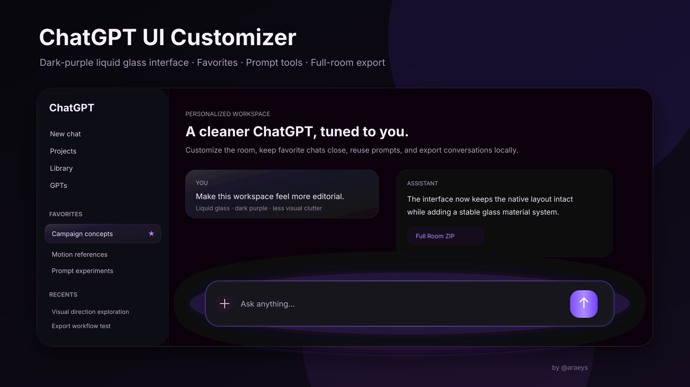

# ChatGPT UI Customizer

> A Chrome extension for customizing ChatGPT with dark-purple liquid-glass UI, animated composer effects, wallpapers, unlimited favorites, prompt utilities, keyboard shortcuts, and full conversation export.



**Current version:** `v2.7.0`  
**Platform:** Chrome / Chromium, Manifest V3  
**Status:** Personal project / portfolio build

ChatGPT UI Customizer started as a theme experiment and grew into a full interface layer for ChatGPT. The goal is simple: keep ChatGPT's core experience intact while making the workspace feel more personal, more visual, and more useful for daily work.

**Case study:** [`docs/PORTFOLIO.md`](docs/PORTFOLIO.md)  
**Architecture:** [`docs/ARCHITECTURE.md`](docs/ARCHITECTURE.md)  
**Privacy & permissions:** [`docs/PRIVACY.md`](docs/PRIVACY.md)

## Quick start

### Option 1 — Clone with Git

```bash
git clone https://github.com/araeys/chatgpt-ui-customizer.git
cd chatgpt-ui-customizer
```

Then load it into Chrome:

1. Open `chrome://extensions`
2. Enable **Developer mode**
3. Click **Load unpacked**
4. Select the cloned `chatgpt-ui-customizer` folder
5. Open or refresh `https://chatgpt.com`

> Disable older builds of this extension before loading a newer one. Running multiple versions at the same time can cause competing stylesheets and duplicated UI behavior.

### Option 2 — Download as ZIP

1. Click **Code → Download ZIP** on this repository
2. Extract the ZIP
3. Open `chrome://extensions`
4. Enable **Developer mode**
5. Click **Load unpacked**
6. Select the extracted project folder
7. Refresh ChatGPT

## How to use

After loading the extension, open `chatgpt.com` normally. The custom UI is injected directly into ChatGPT.

### Appearance

Use the extension popup to customize:

- dark-purple accent color
- liquid-glass intensity
- reflection and depth
- room background color
- custom wallpaper
- wallpaper opacity and blur
- wallpaper scale from 25% to 400%
- wallpaper X/Y position
- message width and UI density
- animation intensity
- composer glow motion

Changes are designed to preview live on the active ChatGPT tab.

### Favorites

Hover a conversation in the ChatGPT sidebar and use the Favorite control to save it into the extension's local **Favorites** section.

Favorites are separate from ChatGPT's native Pin feature and are not limited by the native Pin count.

### Prompt Library

Open the extension panel, save reusable prompts into the Prompt Library, then copy the prompt and paste it into ChatGPT.

The current workflow is intentionally clipboard-first instead of directly modifying ChatGPT's ProseMirror editor.

### Prompt Enhancer

Paste or enter a rough prompt into the Prompt Enhancer, choose an enhancement style, then copy the generated result back into ChatGPT.

### Keyboard shortcuts

- `Ctrl + N` attempts to open a new ChatGPT conversation when Chromium allows the page to receive the shortcut
- `Alt + N` is the reliable New Chat fallback because Chrome can reserve `Ctrl + N` for **New Window**
- additional extension shortcuts can be configured from the UI

### Export a conversation

Open the extension panel and go to **Export**.

Available outputs include:

- Full Room ZIP
- HTML
- Markdown
- JSON

**Full Room ZIP** uses the integrated export engine to capture the current conversation, transcript data, and recoverable assets. The current-room export is built and downloaded without opening a separate visible manager tab.

## Updating an existing clone

If you already cloned the repository, update it with:

```bash
cd chatgpt-ui-customizer
git pull origin main
```

Then go to `chrome://extensions` and click **Reload** on the extension, or refresh the ChatGPT tab if Chrome has already reloaded the unpacked extension.

## Making your own version

Fork the repository on GitHub first, then clone your fork:

```bash
git clone https://github.com/YOUR-USERNAME/chatgpt-ui-customizer.git
cd chatgpt-ui-customizer
```

Create a branch for your changes:

```bash
git checkout -b my-custom-theme
```

After editing:

```bash
git add .
git commit -m "Customize ChatGPT UI"
git push origin my-custom-theme
```

`git clone` downloads a repository to your computer. `git push` sends your local commits back to a remote repository, so it is used after you have made changes, not for the initial download.

## What it adds

### Dark-purple liquid-glass interface
- Near-black / dark-purple visual system
- Liquid-glass surfaces for menus, dialogs, controls, composer, and selected UI areas
- Pointer-reactive reflections and subtle depth
- One-surface hierarchy to avoid stacked borders and visual noise
- Stable semantic styling instead of constantly re-decorating the DOM

### Animated composer
- Multi-layer purple ambient glow
- Moving perimeter reflection
- Focus breathing animation
- Embossed liquid corners
- Motion intensity control
- Performance-conscious animation using mostly `transform` and `opacity`

### Custom room appearance
- Custom room background color
- Wallpaper upload
- Wallpaper opacity and blur
- Scale from 25% to 400%
- X/Y positioning
- Cover / contain / original fit modes

### Unlimited Favorites
ChatGPT's native Pin feature is left untouched. The extension adds a separate local **Favorites** section in the sidebar so any number of conversations can be saved for quick access.

Favorites are stored in `chrome.storage.local` and do not modify the conversation itself.

### Prompt utilities
- Local Prompt Library
- Prompt Enhancer workflow
- Clipboard-first interaction to avoid fighting ChatGPT's editor internals

### Keyboard shortcuts
- `Ctrl + N` attempts to open a new ChatGPT conversation when Chromium dispatches the event
- `Alt + N` is included as the reliable fallback because Chrome can reserve `Ctrl + N` for New Window
- Additional shortcuts can be configured from the extension UI

### Full Room Export
The project integrates a room-export engine for exporting the current ChatGPT conversation directly to a ZIP without opening a separate manager tab.

The export pipeline includes:
- API-first conversation capture
- Markdown and JSON transcript output
- Attachment and generated-file recovery
- Image/media collection
- MIME and binary validation
- File-ID/content-hash deduplication
- Export integrity diagnostics
- No-new-tab current-room ZIP export

Simple HTML, Markdown, and JSON exports are also available.

## Why I built it

I use ChatGPT heavily for creative work, research, prompting, and project iteration. I wanted an interface that felt less generic and solved a few workflow gaps I kept running into:

- stronger visual identity
- better control over the room background
- unlimited favorite conversations
- reusable prompts
- quick keyboard navigation
- reliable local conversation export

The interesting part of the project became keeping those additions stable while ChatGPT behaves like a modern React SPA with streaming content, portal-based menus, client-side navigation, and frequently changing DOM structure.

## Engineering notes

The extension follows a few rules learned through repeated regression testing:

1. **Do not continuously re-style streaming DOM.** Character-data mutations from assistant streaming are ignored.
2. **Prefer semantic selectors for first-paint styling.** Menus and dialogs should not flash native styling before the extension catches up.
3. **One component = one glass surface.** Nested rows inherit the material instead of stacking borders and shadows.
4. **Keep expensive effects off high-frequency surfaces.** Large glow areas use compositor-friendly animation where possible.
5. **Treat ChatGPT as a moving target.** Selectors use semantic attributes and fallbacks instead of relying only on generated class names.

## Architecture

```text
ChatGPT UI Customizer
├── manifest.json
├── content.js             # UI layer, favorites, shortcuts, theme behavior
├── exporter-content.js    # conversation/export extraction helpers
├── background.js          # background/export transport and download flow
├── manager.js             # exporter management logic
├── zip.js                 # ZIP creation
├── theme.css              # ChatGPT visual system
├── suite.css              # extension panels/components
├── popup.html
├── popup.js
└── popup.css
```

The extension uses Manifest V3 and runs only on ChatGPT/OpenAI-related hosts declared in `manifest.json`.

## Public repository note

This repository is the **portfolio/source showcase** for the project. The packaged personal build is maintained separately while the public snapshot is being cleaned for broader distribution, especially around exporter permissions and release packaging.

That separation is intentional: the exporter has access to authenticated ChatGPT resources in the local browser session, so a public installable release should be reviewed and documented more carefully than a visual-only theme.

## Privacy and permissions

The project is designed as a local browser extension. It does not include analytics or an external telemetry service.

The integrated exporter needs broader browser permissions than a visual-only theme because it has to recover conversation data and downloadable assets from the authenticated ChatGPT session. Authentication context is used in-memory by the extension to perform those local export requests; the project does not intentionally persist or transmit access tokens to a third-party server.

See [`docs/PRIVACY.md`](docs/PRIVACY.md) for the permission model and exporter notes.

## Performance

The visual system deliberately avoids continuously animating expensive full-screen blur filters.

Examples:
- composer halo motion relies mainly on `transform` and `opacity`
- streaming text does not trigger full native-glass reclassification
- nested glass components are flattened into a single surface hierarchy
- UI animation can be disabled
- `prefers-reduced-motion` is respected

## Current scope

This is a personal/portfolio build, not a Chrome Web Store release. ChatGPT can change its frontend at any time, so future OpenAI UI updates may require selector maintenance.

## Credits / research references

The project was informed by public experiments and documentation around ChatGPT DOM behavior and liquid-glass UI techniques, including:

- [Dworrall21/chatgpt-bridge](https://github.com/Dworrall21/chatgpt-bridge/blob/main/dom-selectors.md) for ChatGPT DOM research
- [alexchexes ChatGPT styling gist](https://gist.github.com/alexchexes/d2ff0b9137aa3ac9de8b0448138125ce) for surface/fade behavior research
- [nikdelvin/liquid-glass](https://github.com/nikdelvin/liquid-glass) and [dpawlikowski/liquid-glass](https://github.com/dpawlikowski/liquid-glass) for liquid-glass rendering ideas
- [tlyyxjz ProseMirror injection gist](https://gist.github.com/tlyyxjz/5e6edbc7e97cb3a7682af8520de250ce) during early Prompt Library experiments

The current Prompt Library intentionally uses a clipboard-first workflow rather than direct ProseMirror injection.

## Disclaimer

ChatGPT UI Customizer is an independent personal project and is not affiliated with, endorsed by, or sponsored by OpenAI. ChatGPT and OpenAI are trademarks of their respective owner.

---

Built by **@araeys** as a browser-extension UI engineering project.
